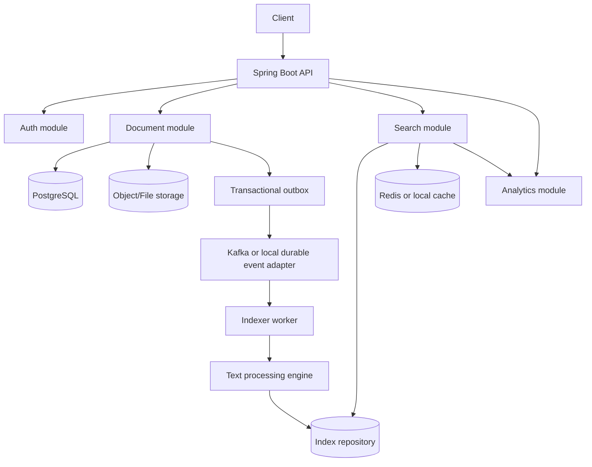

# MiniSearch Product and Engineering Specification

| Field | Value |
| --- | --- |
| Status | Draft for implementation |
| Version | 1.0.0 |
| Last updated | 2026-07-14 |
| Target runtime | Java 17, Spring Boot 4.1 |
| Initial deployment | Modular monolith with asynchronous workers |

Implementation progress is tracked in the ordered [task ledger](./TASKS.md).

## 1. Purpose

MiniSearch is a backend-focused document search engine that indexes `txt`, `md`, and `pdf` files into a custom positional inverted index. It provides authenticated document management, asynchronous indexing, ranked and filtered search, highlighted snippets, autocomplete, spelling suggestions, and search analytics.

The initial release is production-inspired rather than production-distributed. It runs as one deployable Spring Boot application whose modules communicate through explicit interfaces and events. PostgreSQL, Kafka, and Redis remain replaceable infrastructure boundaries so that the indexer and search path can later be deployed independently without rewriting domain logic.

## 2. Goals and non-goals

### 2.1 Goals

- Demonstrate custom data structures and search algorithms rather than delegating search to Elasticsearch, Solr, Lucene, or a database full-text extension.
- Keep uploads fast by separating file persistence from indexing.
- Provide stable search results while concurrent index updates occur.
- Support at least 100,000 indexed documents and 100 concurrent uploads on the reference environment.
- Make behavior measurable with repeatable correctness, concurrency, and performance tests.
- Establish module boundaries suitable for later service extraction and index sharding.

### 2.2 Non-goals for version 1

- Semantic or vector search.
- Web crawling.
- OCR for scanned PDFs.
- Rich document formats such as DOCX, HTML, or images.
- Multi-region availability or consensus between index replicas.
- A graphical administration dashboard.
- Fully distributed index sharding.
- Guaranteed linguistic stemming for every language.

## 3. Quality and design principles

1. **Correctness before optimization:** ranking, parsing, authorization, and index mutation must have deterministic tests before compression or sharding is introduced.
2. **Explicit boundaries:** controllers depend on application services; application services depend on ports; infrastructure implements those ports.
3. **Asynchronous, idempotent indexing:** duplicate and out-of-order events must not corrupt the index.
4. **Immutable search snapshots:** a query reads one published index generation and never observes a partially applied update.
5. **Secure by default:** deny unauthenticated access except registration, login, refresh, and health liveness.
6. **Observable behavior:** important operations expose structured logs, counters, timers, and correlation IDs.
7. **Versioned contracts:** REST contracts, event schemas, database migrations, and index formats are versioned.

## 4. Actors and authorization

### 4.1 Roles

| Actor | Permissions |
| --- | --- |
| Anonymous | Register, login, refresh a valid token, read liveness/readiness endpoints |
| User | Manage and search their own documents; use autocomplete, suggestions, and personal history |
| Admin | Manage and search all documents; view aggregate analytics; trigger reindex operations |

Ownership checks are enforced in application services, not only in controllers. Search results must exclude documents the caller cannot read.

### 4.2 Authentication requirements

| ID | Requirement |
| --- | --- |
| AUTH-01 | Register with a unique, normalized email and password. |
| AUTH-02 | Hash passwords using an adaptive password hash; plaintext passwords are never logged or stored. |
| AUTH-03 | Login returns a short-lived access JWT and a rotating refresh token. |
| AUTH-04 | Refresh rotates the refresh token and invalidates the previous token atomically. Reuse revokes that token family. |
| AUTH-05 | Logout revokes the submitted refresh token. Access JWTs remain valid until their short expiry. |
| AUTH-06 | JWTs contain subject, role, issued-at, expiry, token ID, and issuer claims and are signed with an externally configured key. |
| AUTH-07 | Authentication endpoints are rate-limited and return generic credential errors. |

Default token policy: access token 15 minutes; refresh token 30 days; refresh tokens are stored only as hashes.

## 5. Functional requirements

### 5.1 Document management

| ID | Requirement |
| --- | --- |
| DOC-01 | Accept multipart uploads for `.txt`, `.md`, and `.pdf`. Validate both extension and detected media type. |
| DOC-02 | Persist the file before committing metadata and an indexing outbox event. |
| DOC-03 | Return `202 Accepted` after durable storage and metadata creation; do not wait for indexing. |
| DOC-04 | Expose metadata: ID, title, owner, size, upload time, status, version, language, type, checksum, and word count when available. |
| DOC-05 | Updating content creates a new monotonically increasing document version and schedules reindexing. |
| DOC-06 | Updating title or language also schedules reindexing because both affect search behavior. |
| DOC-07 | Deletion is logically recorded, immediately hidden from reads/search, and asynchronously removes indexed content and stored files. |
| DOC-08 | Re-uploading identical content for the same document is allowed but detected by checksum; a no-content-change update does not rebuild postings unless searchable metadata changed. |
| DOC-09 | A user can read, update, and delete only owned documents; an admin can operate on all documents. |

Document states are:

```text
UPLOADED -> INDEXING -> INDEXED
    |           |          |
    +-----------+----------+-> DELETE_PENDING -> DELETED
                |
                +-> INDEX_FAILED -> INDEXING (retry/reindex)
```

Only `INDEXED` documents are searchable. An update makes the new version `UPLOADED`; the last successfully indexed version remains searchable until the replacement snapshot is atomically published. A deletion hides all versions immediately.

### 5.2 Indexing pipeline

| ID | Requirement |
| --- | --- |
| INDEX-01 | Publish `document.uploaded`, `document.updated`, and `document.deleted` events through a transactional outbox. |
| INDEX-02 | Claim events concurrently while ensuring only one active indexing operation per document. |
| INDEX-03 | Extract text with bounded memory and reject encrypted, malformed, or oversized input with a stable failure reason. |
| INDEX-04 | Normalize Unicode, case-fold using `Locale.ROOT`, tokenize, remove language-specific stop words when supported, and stem supported languages. |
| INDEX-05 | Build postings containing document ID, document version, term frequency, and sorted token positions. |
| INDEX-06 | Store document length, indexed title terms, vocabulary document frequency, and average document length for ranking. |
| INDEX-07 | Applying the same event more than once has no additional effect. Older document versions cannot replace newer versions. |
| INDEX-08 | Publish `index.completed` only after the new index generation is durable and visible. |
| INDEX-09 | Retry transient failures with exponential backoff; move terminal failures to a dead-letter topic/queue and set `INDEX_FAILED`. |
| INDEX-10 | Graceful shutdown stops accepting work, finishes or safely releases claimed work, and never publishes a partial generation. |

Text-processing order:

```text
extract -> Unicode normalize -> case fold -> tokenize -> stop-word filter -> stem
```

Both the original normalized token and its stem may be retained in term metadata where highlighting or suggestion display requires the surface form. Token positions are assigned before stop-word removal so phrase semantics can distinguish removed words.

### 5.3 Search and query language

| ID | Requirement |
| --- | --- |
| SEARCH-01 | Support unquoted term search with implicit `AND`. Example: `spring boot`. |
| SEARCH-02 | Support phrases with double quotes. Example: `"spring boot"`. |
| SEARCH-03 | Support uppercase or lowercase `AND`, `OR`, and binary `NOT`, with parentheses. |
| SEARCH-04 | Operator precedence is `NOT`, then `AND`, then `OR`; parentheses override precedence. |
| SEARCH-05 | Support prefix terms with a trailing `*`, such as `spr*`. The autocomplete endpoint accepts a bare prefix such as `spr`. |
| SEARCH-06 | Support fuzzy terms with `~` or automatic suggestion fallback. Example: `sprng~`. Fuzzy expansion is bounded by configured edit distance and candidate count. |
| SEARCH-07 | Support filters `owner:`, `language:`, `type:`, `from:`, and `to:`. Date values use ISO-8601 dates. |
| SEARCH-08 | Return ranked, paginated results with metadata, score, and highlighted snippet. |
| SEARCH-09 | Reject invalid syntax with a position-aware `400` error. Never silently reinterpret malformed Boolean queries. |
| SEARCH-10 | Record normalized query, user, timestamp, latency, result count, and success/failure asynchronously. |

Examples:

```text
spring boot
"spring boot"
spring AND kafka
spring OR kafka
spring NOT rabbitmq
(spring OR kotlin) AND kafka
spr*
sprng~
spring language:en type:pdf from:2026-01-01
```

`NOT` is binary in version 1: `A NOT B` means `A AND NOT B`. A standalone negative query is rejected because it would require scanning the complete authorized document universe.

### 5.4 Ranking

Ranking is delivered in explicit phases:

| Phase | Algorithm | Required |
| --- | --- | --- |
| 1 | Term frequency | Yes, first implementation milestone |
| 2 | TF-IDF | Yes, version 1 |
| 3 | BM25 | Optional stretch goal |

The version 1 score is:

```text
score = bodyTfIdf
      + titleBoost * titleTfIdf
      + phraseBoost * matchedPhraseCount
      + exactTermBoost * exactTermMatchCount
      + optionalRecencyBoost
```

TF-IDF definitions:

```text
tf(t,d)  = 1 + ln(frequency(t,d))
idf(t)   = ln((N + 1) / (df(t) + 1)) + 1
tfidf    = tf(t,d) * idf(t)
```

Default boosts are configuration, not hard-coded behavior: title `2.0`, phrase `3.0`, exact term `0.5`, recency disabled. Results are ordered by descending score, then descending upload time, then ascending document ID for deterministic pagination.

### 5.5 Snippets and highlighting

| ID | Requirement |
| --- | --- |
| SNIP-01 | Return a bounded text window centered on the densest group of matched positions. |
| SNIP-02 | Prefer phrase windows over isolated term windows. |
| SNIP-03 | HTML-escape document text before adding `<mark>` tags. |
| SNIP-04 | Highlight matched surface forms case-insensitively without altering original display text. |
| SNIP-05 | Include ellipses when the window omits leading or trailing content. |

Default snippet length is 240 characters with a hard maximum of 500 characters.

### 5.6 Autocomplete and spelling suggestions

| ID | Requirement |
| --- | --- |
| AUTO-01 | Maintain a Trie of normalized vocabulary terms and popular normalized multi-term queries. |
| AUTO-02 | Return at most 10 completions ordered by popularity, then lexicographically. |
| AUTO-03 | Update vocabulary counts as index generations are published and removed. |
| SUGG-01 | Find spelling candidates using bounded Levenshtein distance over a pruned vocabulary candidate set. |
| SUGG-02 | Prefer lower edit distance, then higher document frequency, then lexical order. |
| SUGG-03 | Return the original term when it exists; return no suggestion when confidence is below threshold. |

### 5.7 Search history and analytics

| ID | Requirement |
| --- | --- |
| ANALYTICS-01 | Persist search history asynchronously so analytics failure does not fail a search. |
| ANALYTICS-02 | Trending searches aggregate normalized successful queries over a configurable time window. |
| ANALYTICS-03 | Admins can query aggregate latency, cache hit rate, failed-query count, and top searches. |
| ANALYTICS-04 | Users can read and delete their personal search history. |

## 6. External API contract

All endpoints are under `/api/v1`. Request and response bodies use JSON except multipart upload. Timestamps are UTC ISO-8601 instants. IDs are UUIDs. Pagination is zero-based with default size 20 and maximum size 100.

### 6.1 Endpoints

| Method | Path | Access | Success |
| --- | --- | --- | --- |
| POST | `/auth/register` | Public | `201` |
| POST | `/auth/login` | Public | `200` |
| POST | `/auth/refresh` | Public | `200` |
| POST | `/auth/logout` | Authenticated | `204` |
| POST | `/documents` | User/Admin | `202` |
| GET | `/documents/{id}` | Owner/Admin | `200` |
| GET | `/documents` | User/Admin | `200` |
| PUT | `/documents/{id}` | Owner/Admin | `202` |
| DELETE | `/documents/{id}` | Owner/Admin | `202` |
| GET | `/search` | User/Admin | `200` |
| GET | `/autocomplete` | User/Admin | `200` |
| GET | `/suggest` | User/Admin | `200` |
| GET | `/search-history` | User/Admin | `200` |
| DELETE | `/search-history` | User/Admin | `204` |
| GET | `/analytics/trending` | Admin | `200` |
| POST | `/admin/reindex/{id}` | Admin | `202` |
| GET | `/actuator/health/liveness` | Public | `200` or `503` |
| GET | `/actuator/health/readiness` | Public | `200` or `503` |

### 6.2 Representative payloads

Upload request:

```http
POST /api/v1/documents
Content-Type: multipart/form-data

file=<binary>
title=Spring Notes
language=en
```

Upload response:

```json
{
  "id": "c8c5dc1a-0de7-4d02-ad17-a41809e08724",
  "title": "Spring Notes",
  "ownerId": "a299fe00-8510-4fcb-a211-32dc9dc45d55",
  "fileType": "PDF",
  "sizeBytes": 48192,
  "language": "en",
  "version": 1,
  "status": "UPLOADED",
  "createdAt": "2026-07-14T10:00:00Z"
}
```

Search request:

```http
GET /api/v1/search?q=%22spring%20boot%22%20language%3Aen%20type%3Apdf&page=0&size=20
```

Search response:

```json
{
  "query": "\"spring boot\" language:en",
  "totalHits": 1,
  "page": 0,
  "size": 20,
  "tookMs": 4,
  "indexGeneration": 42,
  "results": [
    {
      "documentId": "c8c5dc1a-0de7-4d02-ad17-a41809e08724",
      "title": "Spring Notes",
      "score": 7.4312,
      "language": "en",
      "fileType": "PDF",
      "version": 1,
      "uploadedAt": "2026-07-14T10:00:00Z",
      "snippet": "…<mark>Spring Boot</mark> makes dependency injection easier.…"
    }
  ]
}
```

### 6.3 Error format

Errors follow RFC 9457 Problem Details using `application/problem+json`.

```json
{
  "type": "https://minsearch.dev/problems/invalid-query",
  "title": "Invalid search query",
  "status": 400,
  "detail": "Expected an expression after AND",
  "instance": "/api/v1/search",
  "code": "SEARCH_INVALID_SYNTAX",
  "correlationId": "01J2R9X9FCG8YQXK5Y5AXYPC7M",
  "position": 12
}
```

## 7. Architecture

### 7.1 Logical architecture



### 7.2 Modules

| Module | Responsibilities | Must not own |
| --- | --- | --- |
| `auth` | Identity, JWT, refresh rotation, role policy | Document authorization rules |
| `document` | Uploads, storage, metadata, ownership, versioning, lifecycle events | Text processing or ranking |
| `index` | Extraction, analysis, postings, index snapshots, event handling | HTTP contracts |
| `search` | Query lexing/parsing/planning, retrieval, ranking, pagination, snippets | File persistence |
| `autocomplete` | Trie and completion ordering | Search result ranking |
| `cache` | Cache keys, serialization, TTL, invalidation | Query semantics |
| `analytics` | History, trending, performance aggregates | Blocking the search response |
| `shared` | IDs, clocks, problem details, event envelope primitives | Domain-specific business rules |

Package layout follows package-by-feature. Each feature uses `api`, `application`, `domain`, and `infrastructure` subpackages where needed. Domain code has no dependency on Spring MVC, JPA, Kafka, or Redis.

### 7.3 Deployment evolution

1. **Local/test:** one process, PostgreSQL, local filesystem, in-process durable outbox poller, Caffeine cache.
2. **Reference deployment:** one API process plus one or more worker instances, PostgreSQL, Kafka, Redis, shared object storage, durable index repository.
3. **Scale-out:** partition events and index shards by stable document-ID hash; route queries to shards and merge top-K results.

## 8. Data design

### 8.1 PostgreSQL schema

All schema changes use ordered migrations. Table and column names use `snake_case`.

#### `users`

| Column | Type | Constraints |
| --- | --- | --- |
| `id` | UUID | PK |
| `email` | VARCHAR(320) | unique on normalized value, not null |
| `password_hash` | VARCHAR(255) | not null |
| `role` | VARCHAR(20) | not null |
| `created_at` | TIMESTAMPTZ | not null |
| `updated_at` | TIMESTAMPTZ | not null |

#### `refresh_tokens`

| Column | Type | Constraints |
| --- | --- | --- |
| `id` | UUID | PK; JWT/token ID |
| `user_id` | UUID | FK `users`, indexed |
| `family_id` | UUID | indexed |
| `token_hash` | VARCHAR(255) | unique, not null |
| `expires_at` | TIMESTAMPTZ | not null |
| `used_at` | TIMESTAMPTZ | nullable |
| `revoked_at` | TIMESTAMPTZ | nullable |
| `created_at` | TIMESTAMPTZ | not null |

#### `documents`

| Column | Type | Constraints |
| --- | --- | --- |
| `id` | UUID | PK |
| `owner_id` | UUID | FK `users`, indexed |
| `title` | VARCHAR(500) | not null |
| `language` | VARCHAR(35) | BCP 47 tag, not null |
| `file_type` | VARCHAR(10) | not null |
| `status` | VARCHAR(30) | indexed, not null |
| `current_version` | INTEGER | positive, not null |
| `indexed_version` | INTEGER | nullable |
| `created_at` | TIMESTAMPTZ | not null |
| `updated_at` | TIMESTAMPTZ | not null |
| `deleted_at` | TIMESTAMPTZ | nullable |

#### `document_versions`

| Column | Type | Constraints |
| --- | --- | --- |
| `document_id` | UUID | composite PK, FK `documents` |
| `version` | INTEGER | composite PK |
| `storage_key` | VARCHAR(1000) | unique, not null |
| `size_bytes` | BIGINT | non-negative |
| `checksum_sha256` | CHAR(64) | indexed, not null |
| `word_count` | INTEGER | nullable until indexed |
| `created_at` | TIMESTAMPTZ | not null |

#### `outbox_events`

| Column | Type | Constraints |
| --- | --- | --- |
| `id` | UUID | PK |
| `aggregate_type` | VARCHAR(100) | not null |
| `aggregate_id` | UUID | indexed, not null |
| `event_type` | VARCHAR(100) | indexed, not null |
| `event_version` | INTEGER | not null |
| `payload` | JSONB | not null |
| `occurred_at` | TIMESTAMPTZ | not null |
| `published_at` | TIMESTAMPTZ | nullable, indexed |
| `attempt_count` | INTEGER | not null, default 0 |

#### `processed_events`

| Column | Type | Constraints |
| --- | --- | --- |
| `consumer_name` | VARCHAR(100) | composite PK |
| `event_id` | UUID | composite PK |
| `processed_at` | TIMESTAMPTZ | not null |

#### `search_history`

| Column | Type | Constraints |
| --- | --- | --- |
| `id` | UUID | PK |
| `user_id` | UUID | FK `users`, indexed |
| `query` | TEXT | not null |
| `normalized_query` | TEXT | not null |
| `result_count` | BIGINT | not null |
| `latency_ms` | INTEGER | non-negative |
| `succeeded` | BOOLEAN | not null |
| `searched_at` | TIMESTAMPTZ | indexed, not null |

### 8.2 Index structures

Core logical structures:

```java
record Posting(
    UUID documentId,
    int documentVersion,
    int frequency,
    int[] positions
) {}

record TermEntry(
    String term,
    int documentFrequency,
    PostingList postings
) {}
```

An index generation contains:

- term dictionary: normalized term to immutable posting list;
- document table: version, length, title terms, metadata/filter fields, and searchable-state marker;
- vocabulary Trie and surface-form statistics;
- corpus statistics: searchable document count and average document length;
- schema/index format version, generation number, creation time, and checksum.

Posting lists are sorted by document ID; positions are strictly increasing. The first correct implementation uses primitive arrays to avoid boxing. Compression with delta encoding and variable-byte encoding is a later optimization guarded by compatibility tests.

### 8.3 Index publication and concurrency

- Workers build mutations outside the reader critical section.
- Publication creates a new immutable generation or immutable segment set.
- An atomic reference swaps readers to the new generation.
- Active queries retain the old generation until completion.
- Obsolete generations are reclaimed only after no reader references remain.
- A per-document lock or partitioned single-writer rule prevents concurrent versions of the same document from racing.
- Event version checks reject stale updates and make duplicate delivery safe.

This read-copy-update model guarantees search availability and avoids holding global write locks during extraction or tokenization.

## 9. Events

Every event uses this envelope:

```json
{
  "eventId": "7d0226c8-6b4e-481f-994b-132ab39ed65d",
  "eventType": "document.uploaded",
  "schemaVersion": 1,
  "occurredAt": "2026-07-14T10:00:00Z",
  "correlationId": "01J2R9X9FCG8YQXK5Y5AXYPC7M",
  "aggregateId": "c8c5dc1a-0de7-4d02-ad17-a41809e08724",
  "aggregateVersion": 1,
  "payload": {}
}
```

| Topic | Partition key | Important payload |
| --- | --- | --- |
| `document.uploaded` | document ID | storage key, title, owner, language, type, checksum |
| `document.updated` | document ID | new version and searchable metadata |
| `document.deleted` | document ID | deletion time, last version |
| `index.completed` | document ID | indexed version, generation, word count, duration |

Delivery is at least once. Consumers must be idempotent. Ordering is guaranteed only for a single document because document ID is the partition key.

## 10. Cache design

Search cache keys include:

```text
index generation + authorization scope + normalized query AST + filters + page + size + ranking config version
```

- Default TTL: 10 minutes with bounded size and least-recently-used eviction.
- Do not cache invalid syntax, server errors, or unrestricted data under a user-scoped key.
- Publishing a new index generation naturally invalidates old search keys through generation-keying; old keys expire without a global delete scan.
- Autocomplete keys use vocabulary generation plus normalized prefix.
- Cache serialization is versioned.
- Cache failure is fail-open: execute search directly and record the failure metric.

## 11. Non-functional requirements

### 11.1 Performance service-level objectives

| ID | Metric | Target and measurement |
| --- | --- | --- |
| PERF-01 | Search latency | p95 below 20 ms for warm-index, non-fuzzy top-20 queries over 100,000 documents, excluding network, on the reference machine |
| PERF-02 | Upload API | p95 below 500 ms for files up to 10 MiB after the request body is received, excluding client upload time |
| PERF-03 | Index throughput | At least 500 representative documents/minute with four workers on the reference machine |
| PERF-04 | Concurrent uploads | Sustain 100 in-flight uploads without data corruption or request-thread exhaustion |
| PERF-05 | Cache hit rate | Above 70% under a documented repeated-query workload; reported as a workload result, not a universal guarantee |
| PERF-06 | Availability during indexing | Existing index remains queryable during upload, extraction, index build, and failed publication |

The benchmark report must record CPU, memory, disk, JVM flags, document corpus, query distribution, cache state, sample count, warm-up, and percentile method. Targets are not considered met without this context.

### 11.2 Limits

Defaults are externally configurable:

| Limit | Default |
| --- | --- |
| Upload size | 10 MiB |
| Extracted text | 5 million characters |
| Boolean query length | 2,048 characters |
| Query tokens | 100 |
| Parenthesis depth | 10 |
| Prefix expansions | 100 terms |
| Fuzzy candidate expansions | 50 terms |
| Fuzzy edit distance | 2 |
| Search page size | 20 default, 100 maximum |

### 11.3 Reliability

- Database and file/object storage writes use compensating cleanup when a cross-resource operation partially fails.
- Outbox events are committed in the same database transaction as document metadata.
- Index snapshots include checksums and are loaded only after validation.
- Startup recovers the latest valid generation and replays later events.
- Readiness fails if the metadata database or any required index generation is unavailable; optional cache unavailability does not fail readiness.
- Backups cover PostgreSQL, source files, and published index snapshots. The index may also be rebuilt from source files and metadata.

### 11.4 Security

- Validate upload type using content inspection and parser limits; filenames never become storage paths.
- Generate opaque storage keys and prevent path traversal.
- Apply decompression, PDF object, page-count, time, and memory limits to extraction.
- Reject encrypted PDFs in version 1.
- Sanitize all snippets and user-controlled values rendered as HTML.
- Use parameterized database access and strict DTO validation.
- Store secrets outside source control and support key rotation.
- Do not log passwords, tokens, file contents, or full sensitive queries.
- Add security headers, CORS allowlists, request-size limits, and per-user/IP rate limits.
- Keep an audit trail for admin actions and document deletion.

### 11.5 Observability

Required metrics include:

- HTTP request latency/count by route, method, and status;
- search latency, result count, query type, and index generation;
- cache hit, miss, eviction, and error counts;
- indexing duration, throughput, queue lag, retries, and failures;
- index generation, term count, posting count, and approximate memory;
- upload bytes and document status transitions;
- authentication success, failure, refresh reuse, and rate limiting.

Logs are structured JSON in deployed environments and include timestamp, level, service/module, correlation ID, event ID where applicable, and non-sensitive identifiers. Prometheus metrics are required for version 1; OpenTelemetry traces and Grafana dashboards are stretch goals.

## 12. Testing strategy

| Layer | Required coverage |
| --- | --- |
| Unit | tokenizer, normalization, stemmer adapters, Trie, Levenshtein, query lexer/parser, Boolean evaluation, phrase matching, TF/TF-IDF scoring, snippets |
| Property-based | posting positions sorted, duplicate event idempotency, parser never hangs/crashes on generated input, index/search equivalence to a simple reference implementation |
| Integration | PostgreSQL migrations/repositories, file storage, outbox delivery, Redis cache, Kafka event flow, PDF extraction |
| Contract | OpenAPI request/response validation and versioned event schema compatibility |
| Concurrency | simultaneous versions of one document, search during publication, 100 uploads, duplicate/out-of-order events, worker shutdown |
| Security | ownership isolation, role checks, token rotation/reuse, malicious filenames, parser bombs, snippet XSS, oversized inputs |
| End-to-end | register -> upload -> poll status -> search -> update -> search new version -> delete -> absent from search |
| Performance | JMH for algorithms; k6 or Gatling for API workloads; documented 100k-document corpus benchmark |

Tests use deterministic clocks, IDs, and small fixtures. Testcontainers provides real PostgreSQL, Kafka, and Redis in infrastructure integration tests. Performance tests run separately from the default unit-test build.

## 13. API and code standards

- Generate and validate an OpenAPI 3.1 contract for `/api/v1`.
- Use RFC 9457 Problem Details for errors and stable machine-readable error codes.
- Use Bean Validation at input boundaries and domain invariants inside domain objects.
- Use UUIDs externally and avoid exposing sequential database identifiers.
- Never expose persistence entities directly from controllers.
- Keep transactions at application-service boundaries; no open session in view.
- All collection ordering visible to clients must be deterministic.
- Configuration uses typed, validated configuration properties.
- New behavior requires tests and updates to this specification or an Architecture Decision Record when contracts change.
- The build must support formatting, static analysis, unit tests, integration tests, and dependency vulnerability reporting.

## 14. Delivery plan and acceptance gates

### Milestone 0: Foundation

- Establish package/module boundaries, configuration profiles, migrations, Problem Details, correlation IDs, test conventions, and local infrastructure.
- Gate: application starts locally; checks and migrations pass; architecture dependency test enforces boundaries.

### Milestone 1: Authentication and documents

- Implement registration, login, refresh rotation, logout, ownership, upload storage, metadata, versions, and transactional outbox.
- Gate: AUTH-01 through AUTH-07 and DOC-01 through DOC-09 pass end-to-end tests; upload returns before indexing.

### Milestone 2: Asynchronous indexing and TF search

- Implement extraction, analyzer pipeline, positional index, generation publication, basic AND search, TF ranking, and document status flow.
- Gate: duplicate/out-of-order events are safe; search continues during index publication; core end-to-end lifecycle passes.

### Milestone 3: Query language and TF-IDF

- Add phrases, Boolean parser, filters, prefixes, fuzzy expansion, TF-IDF, pagination, and deterministic ranking.
- Gate: SEARCH-01 through SEARCH-10 pass correctness, parser fuzz/property, and authorization tests.

### Milestone 4: Search experience and cache

- Add snippets/highlighting, Trie autocomplete, suggestions, generation-keyed caching, history, and trending analytics.
- Gate: SNIP, AUTO, SUGG, and ANALYTICS requirements pass; cache failure does not break search.

### Milestone 5: Hardening and performance

- Add reference Kafka/Redis adapters, security hardening, metrics, load tests, profiling, primitive posting optimizations, and recovery tests.
- Gate: all PERF targets have a reproducible report or a documented exception with measured bottleneck and follow-up decision.

## 15. Definition of done

A requirement is done only when:

1. Its externally visible contract is documented.
2. Implementation respects module boundaries and configured limits.
3. Automated positive, negative, authorization, and relevant concurrency tests pass.
4. Metrics and safe failure behavior exist for operationally significant paths.
5. Database/event/index format changes are migrated or versioned.
6. The default build is green and no critical vulnerability is knowingly introduced.
7. Performance-sensitive changes include before/after measurements.

Version 1 is done when all required requirements and milestone gates are satisfied, a fresh environment can be started from documented commands, the end-to-end lifecycle passes, and the 100,000-document benchmark report is published.

## 16. Decisions and assumptions requiring explicit change control

The following decisions resolve ambiguities in the initial brief and are normative for version 1:

- The initial codebase is a modular monolith, designed for later service extraction.
- Search is authenticated and owner-scoped for users; admins can search all documents.
- Unquoted adjacent terms imply `AND`.
- Prefix search syntax in the search endpoint is `prefix*`; bare prefixes belong to autocomplete.
- Fuzzy search syntax is `term~`; `/suggest` also supports correction without query execution.
- `NOT` is binary and cannot be used alone.
- Updating a document preserves the last indexed version until the new version is atomically published.
- Deletion hides a document synchronously and removes postings asynchronously.
- English analysis includes stop-word removal and stemming first; unsupported languages receive Unicode normalization and tokenization without stemming.
- Files are limited to 10 MiB by default and scanned PDFs are not OCR-processed.
- TF-IDF is mandatory for version 1; BM25, recency scoring, synonyms, semantic search, sharding, replicas, tracing, dashboards, Kubernetes, and crawling remain stretch goals.

Changes to these decisions require an update to this document and, when architectural, an ADR under `docs/adr/`.
